# Advanced Threat Emulation & SOC Detection Engineering Lab

## 📌 Project Overview
This project simulates a comprehensive 9-stage Advanced Persistent Threat (APT) attack (Red Team) across a hybrid Windows/Linux environment, followed by the development of custom detection rules using Splunk SIEM (Blue Team). 

The objective is to demonstrate practical knowledge of the MITRE ATT&CK framework, adversary tradecraft, lateral movement, and proactive detection engineering (Threat Hunting).

## 🏗️ Lab Architecture
* **Attacker (Kali Linux):** `10.10.30.10`
* **Victim 1 (Windows Server):** `10.10.30.20` - Initial breach point & Pivot.
* **Victim 2 (Ubuntu Desktop):** `10.10.30.30` - Target for lateral movement and data impact.
* **SIEM:** Splunk Enterprise with Sysmon integration.

---

## 🔴 PART 1: Attack Emulation (Red Team Kill Chain)

### Preparation: Defense Evasion
Prior to the attack execution, Windows Defender real-time protection was disabled to ensure payload execution without immediate quarantine, simulating an environment with bypassed or misconfigured AV.
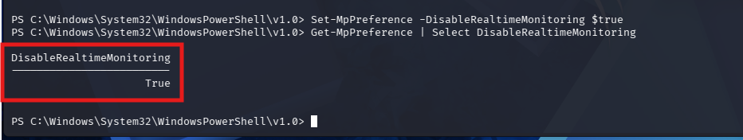

### Stage 1: Initial Access (T1204.002 - Malicious File)
The attack begins with a weaponized Windows Shortcut (`.lnk`) file disguised as a legitimate document. The properties reveal a hidden PowerShell execution string (`-W Hidden`).
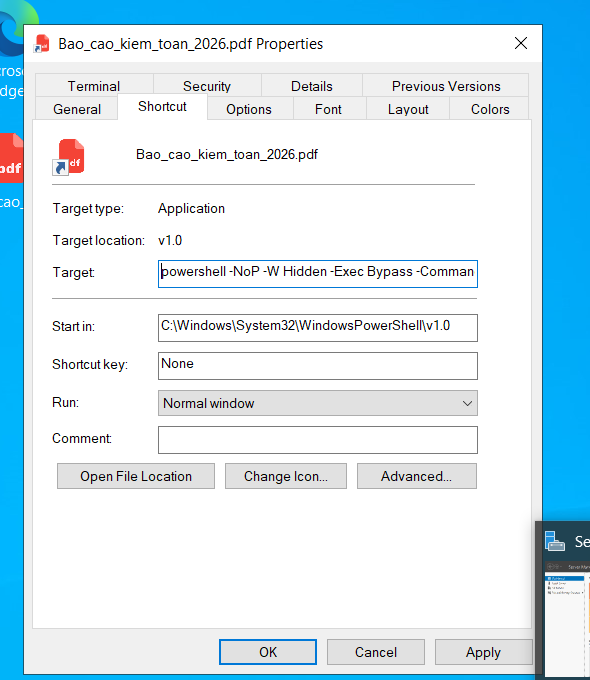

### Stage 2 & 3: Execution & Command and Control (T1059.001 & T1071.001)
The execution of the `.lnk` file triggers a PowerShell script that downloads a reverse shell payload from the Attacker's server and establishes a C2 connection back to `10.10.30.10`.
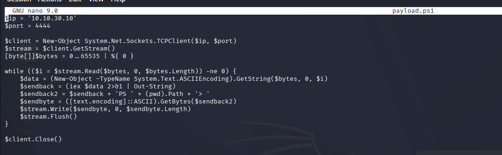
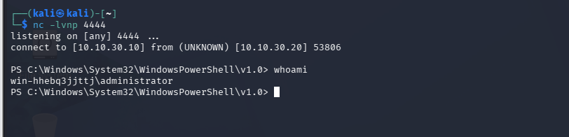

### Stage 4: Windows Persistence & Privilege Escalation (T1136.001 & T1078.001)
To maintain access, a hidden local administrator account named `WinUpdate$` is created and added to the `Administrators` group.
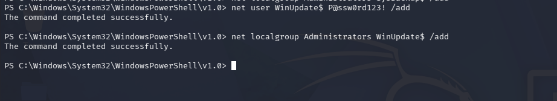

### Stage 5: Discovery (T1018 - Remote System Discovery)
Using ARP scanning, the attacker maps the internal network and identifies a secondary target: an Ubuntu machine at `10.10.30.30`.
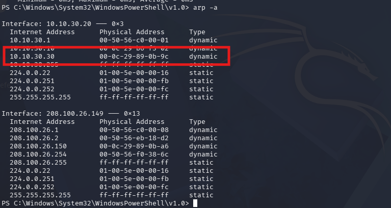

### Stage 6: Credential Access & Exfiltration (T1003.001 & T1041)
The attacker dumps the LSASS process to extract plaintext credentials. To evade local EDR, the dump file is exfiltrated to the Kali machine for offline extraction.
* **Ingress Tool Transfer:** Downloading `procdump.exe` using `certutil`.

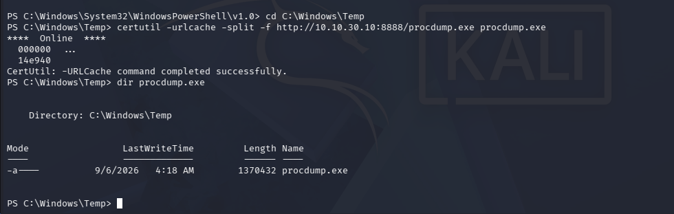
* **Execution:** Dumping LSASS.
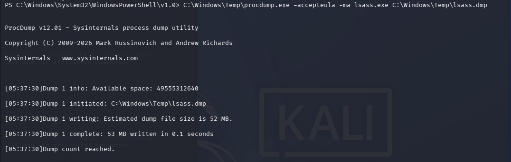
* **Exfiltration over SMB:** Moving `lsass.dmp` to Kali.
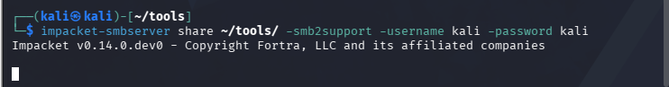
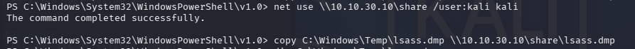
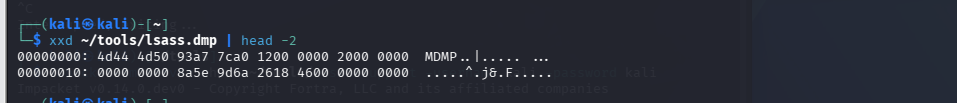
* **Offline Extraction:** Using `pypykatz` to extract the password (`Password123`).
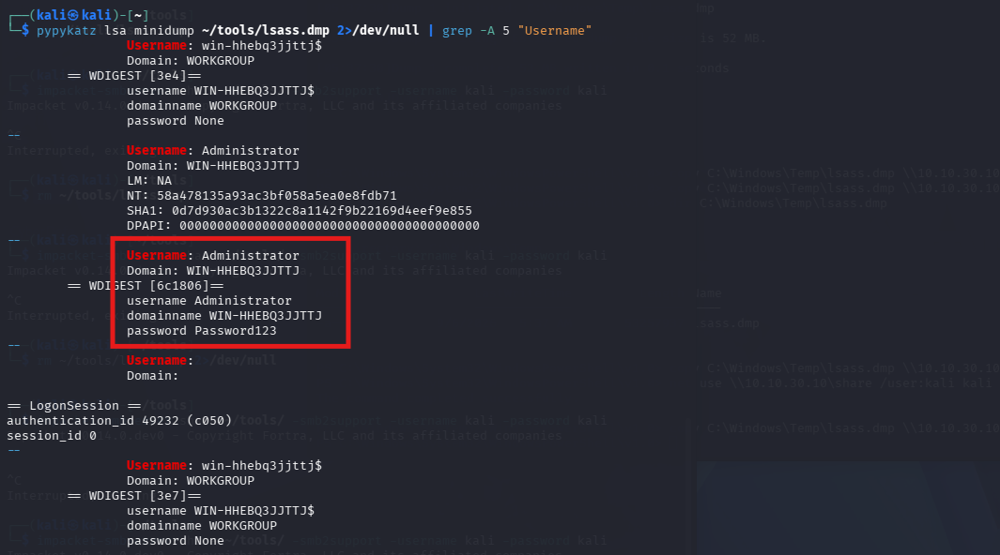

### Stage 7: Lateral Movement (T1021.004 - SSH)
By inspecting the PowerShell history (`ConsoleHost_history.txt`), the attacker discovers previous SSH activity to the Ubuntu machine. Utilizing the extracted password (password reuse), the attacker successfully SSHs into the Ubuntu machine (`10.10.30.30`) by pivoting through the compromised Windows Server (`10.10.30.20`) and directly from Kali.
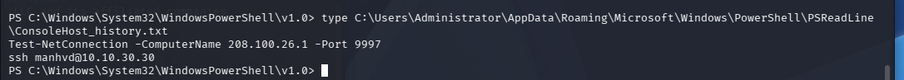
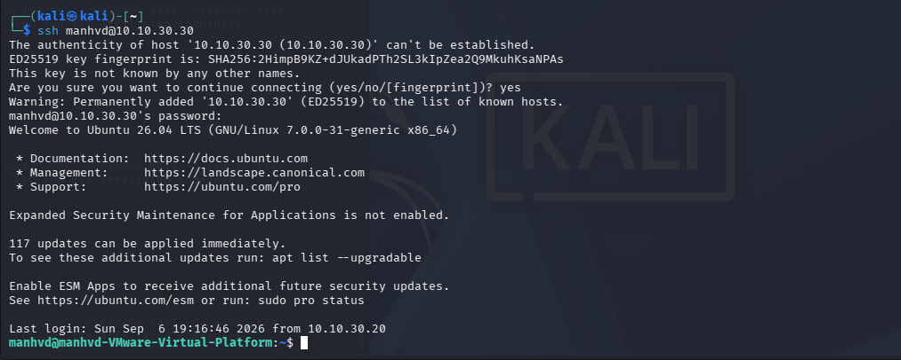

### Stage 8: Linux Persistence (T1098.004 & T1548.003)
The attacker establishes dual persistence on the Linux machine:
1. Pushing a public SSH key to `~/.ssh/authorized_keys` for passwordless login.
2. Modifying `/etc/sudoers.d/backdoor_test` to grant the user `manhvd` root privileges without a password (Sudo Caching/PrivEsc).
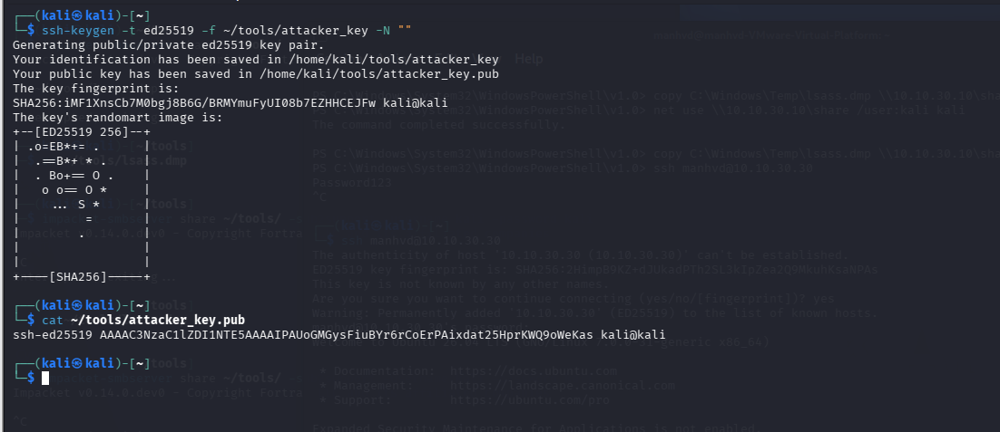
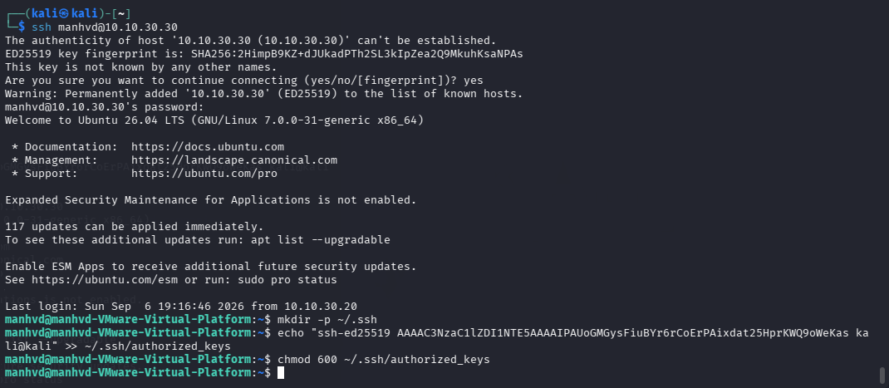
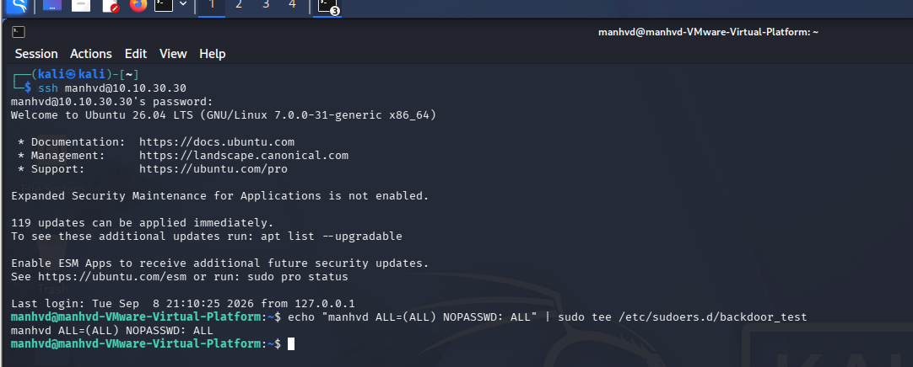

### Stage 9: Impact (T1486 - Data Encrypted for Impact)
The attacker locates sensitive financial reports, encrypts them using `openssl` (AES-256-CBC), and permanently deletes the original files, simulating a targeted Ransomware deployment.
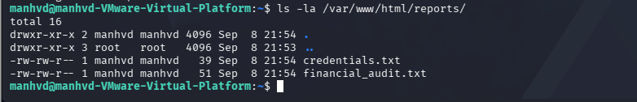
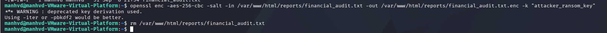
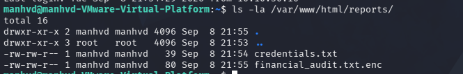

---

## 🔵 PART 2: Detection Engineering (Blue Team Splunk Rules)

Following the attack execution, log analysis was performed using Splunk. Custom SPL (Search Processing Language) queries were developed to detect each stage of the attack lifecycle.

### Rule 1: Malicious PowerShell Execution (Defense Evasion)
**Logic:** Detects PowerShell processes attempting to hide the window, bypass execution policies, or utilize `WebClient` for external downloads. Evaluates risk based on the parent process.
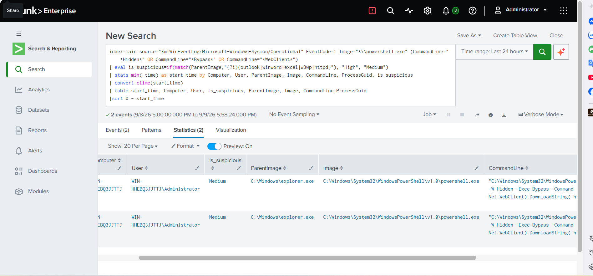

### Rule 2: C2 Network Connection via LOLBins
**Logic:** Correlates Sysmon Event ID 1 (Process Creation) and Event ID 3 (Network Connection) via `ProcessGuid` to identify `powershell.exe` establishing external connections to unusual ports.
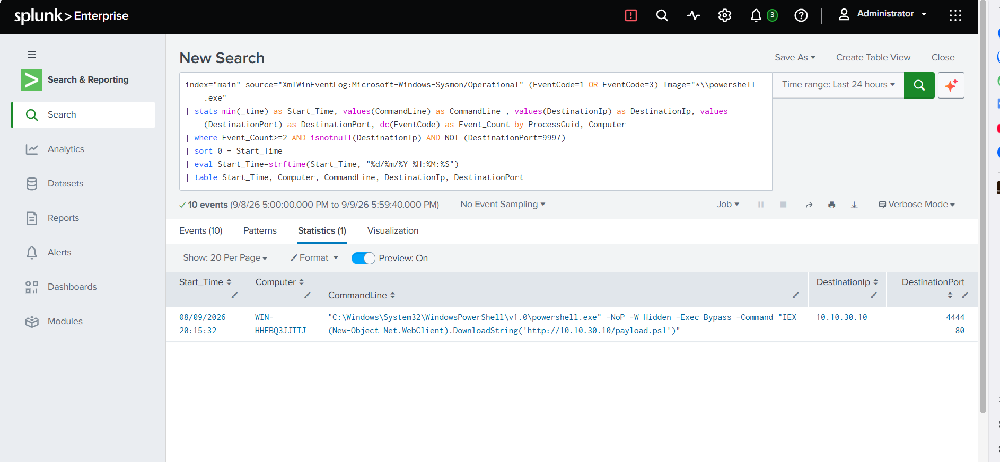

### Rule 3: Suspicious Local Account Creation (Persistence)
**Logic:** Detects the execution of `net.exe` spawned by `powershell.exe` to create new local users and add them to the `Administrators` group (e.g., `WinUpdate$`).
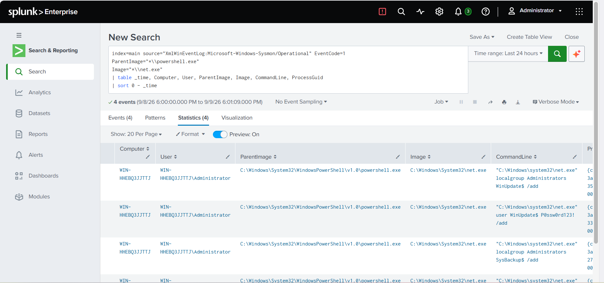

### Rule 4: LSASS Memory Dumping (Credential Access)
**Logic:** Monitors Sysmon logs for command-line arguments indicative of process dumping tools (e.g., `procdump`, `-ma lsass.exe`) interacting with the Local Security Authority Subsystem Service.
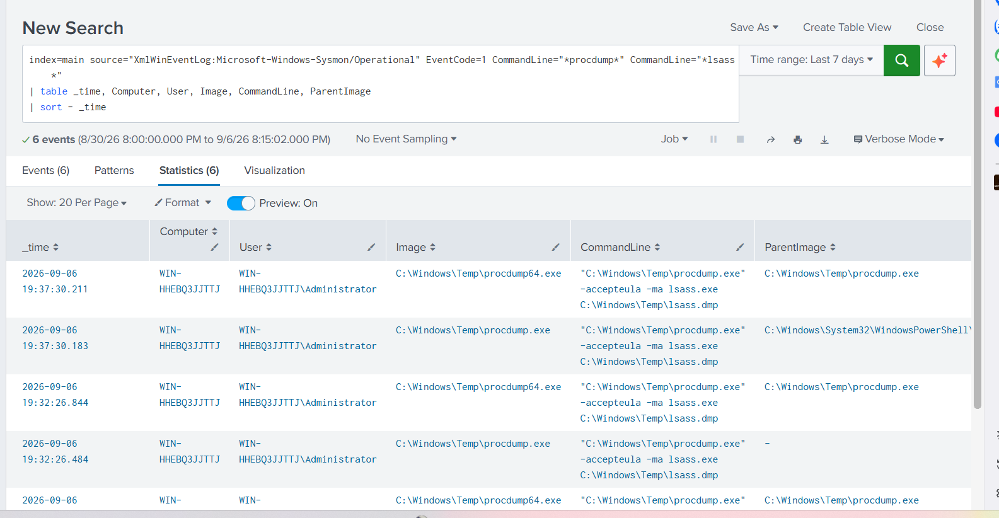

### Rule 5: Internal SSH Lateral Movement
**Logic:** Parses `/var/log/auth.log` to identify successful SSH authentications. Highlights anomalies such as logins originating from the Attacker IP (`10.10.30.10`) or Pivot IP (`10.10.30.20`).
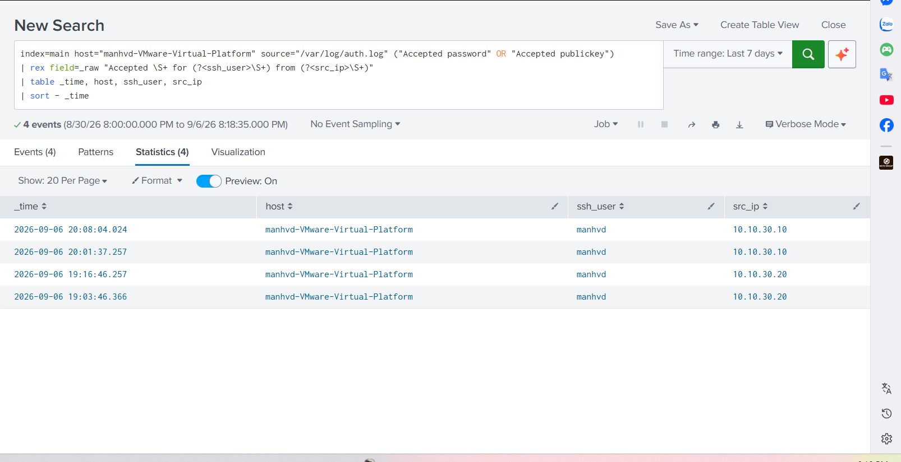

### Rule 6: Linux Privilege Escalation (Sudoers Modification)
**Logic:** Monitors for File Creation/Modification events (Sysmon Event ID 11) within the highly sensitive `/etc/sudoers.d/` directory, identifying potential root backdoors.
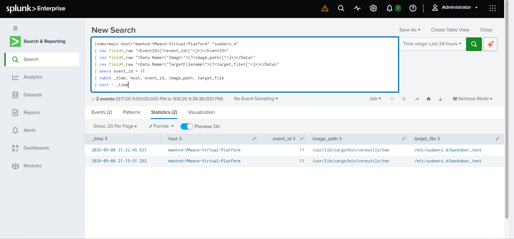

### Rule 7: Ransomware Impact Simulation
**Logic:** Correlates a rapid succession of process creation events (`ls`, `openssl`, `rm`) originating from the same host, targeting a specific directory (`reports`). Identifies data encryption followed by data destruction.
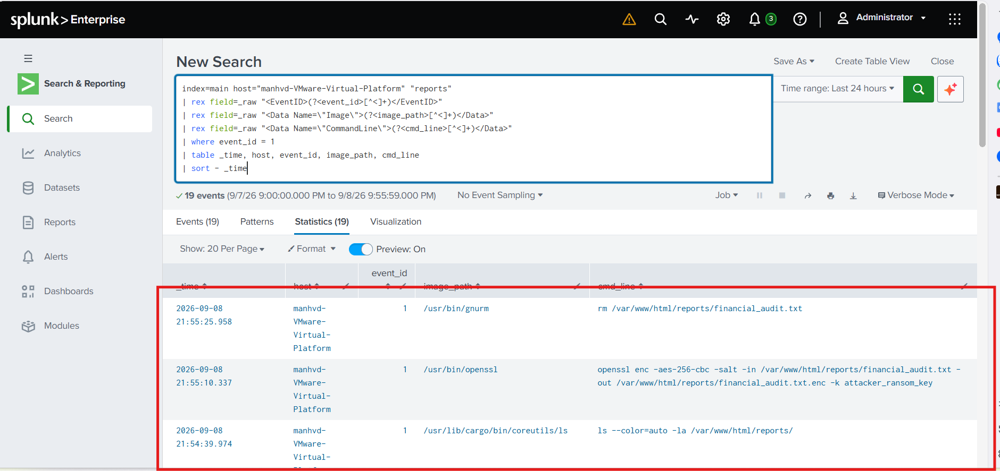

---

## 💡 Detection Gaps & Recommendations
While the SIEM successfully detected the `sudoers.d` modification, it did not alert on the insertion of the SSH public key into `~/.ssh/authorized_keys` (Stage 8b). 
* **Recommendation:** SOC teams should implement additional File Integrity Monitoring (FIM) or Sysmon Event ID 11 rules specifically targeting changes to `.ssh` directories across all endpoints to close this detection gap.
